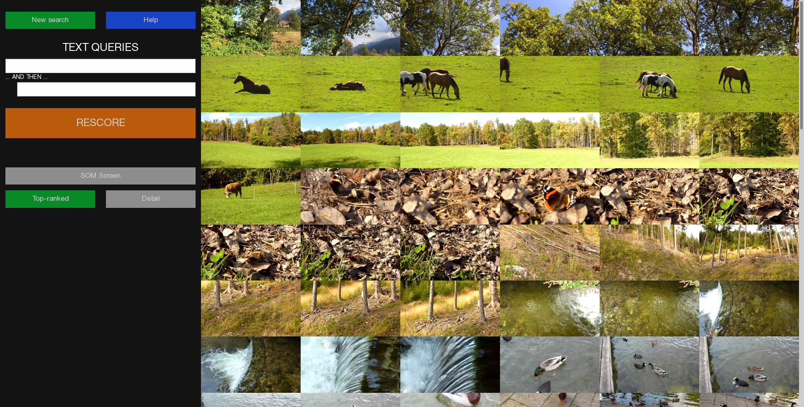

# SOMHunter opensource 

This is an open-source version of the SOMHunter video search and retrieval
engine, slightly simplified from the prototype that was featured at Video
Browser Showdown 2020 in Daejeon, Korea (see https://videobrowsershowdown.org/
).

Main features:

- a very simple demonstration dataset is packed in the repository, indexed V3C1
  dataset will be available for download
- keyword search, similarity-based search
- several ways of browsing and re-scoring the results (including SOMs)
- VBS-compatible submission and logging API clients

SOMHunter is licensed as free software, under the GPLv2 license. This grants
you freedom to use the software for many research purposes and publish the
results. For exploring and referencing the original work, you may find some of
the following articles helpful:

- Kratochvíl, M., Veselý, P., Mejzlík, F., & Lokoč, J.
  (2020, January).
  [SOM-Hunter: Video Browsing with Relevance-to-SOM Feedback Loop](https://link.springer.com/chapter/10.1007/978-3-030-37734-2_71).
  In *International Conference on Multimedia Modeling* (pp. 790-795). Springer, Cham.
- Mejzlík, F., Veselý, P., Kratochvíl, M., Souček, T., & Lokoč, J.
  (2020, June).
  [SOMHunter for Lifelog Search](https://dl.acm.org/doi/abs/10.1145/3379172.3391727).
  In *Proceedings of the Third Annual Workshop on Lifelog Search Challenge* (pp. 73-75).

## Try SOMHunter from Docker   


You can get a working SOMHunter copy from Docker:
```sh
docker pull exaexa/somhunter:v0.1
docker run -ti --rm -p8080:8080 exaexa/somhunter:v0.1
```

After that, open your browser at http://localhost:8080, and use login `som` and password `hunter`.



## Installation from source

Prerequisites:

- a working installation of Node.js with some variant of package manager
  (either `npm` or `yarn`)
- Python 3
- C++ compiler
- `libcurl` (see below for installation on various platforms)

After cloning this repository, change to the repository directory and run

```
npm install
npm run start
```

(Optionally replace `npm` with `yarn`.)

If everything goes all right, you can start browsing at http://localhost:8080/
. The site is password-protected by default, you can use the default login
`som` and password `hunter`, or set a different login in `config/user.js`.

### Getting the dependencies on UNIX systems

You should be able to install all dependencies from the package management. On
Debian-based systems (including Ubuntu and Mint) the following should work:

```
apt-get install build-essential libcurl4-openssl-dev nodejs yarnpkg
```

The build system uses `pkg-config` to find libCURL -- if that fails, either
install the CURL pkgconfig file manually, or customize the build configuration
in `core/binding.gyp` to fit your setup.

Similar (similarly named) packages should be available on most other distributions.

### Getting the dependencies on Windows

The build systems expects libCURL to reside in `c:\Program Files\curl\`.  You
may want to install it using
[vcpkg](https://docs.microsoft.com/en-us/cpp/build/vcpkg?view=vs-2019) as
follows:

- download and install `vcpkg`
- install and export libCURL:
```
vcpkg install curl:x64-windows
vcpkg export --raw curl:x64-windows
```
- copy the directory with the exported libCURL to `c:\Program Files\`.

Alternatively, you can use any working development installation of libCURL by
filling the appropriate paths in `core/binding.gyp`.

### Build problems

We have tested SOMHunter on Windows and several different Linux distributions,
which should cover a majority of target environments. Please report any errors
you encounter using the GitHub issue tracker, so that we can fix them (and
improve the portability of SOMHunter).

### Building the Docker image

The installation is described in `Dockerfile`; you should be able to get a
working, correctly tagged (and possibly customized) image by running this in
your directory:
```sh
docker build -t somhunter:$(git describe --always --tags --dirty=-$USER-$(date +%Y%m%d-%H%M%S)) .
```

## Customizing SOMHunter

The program is structured as follows:

- The frontend requests are routed in `app.js` to views and actions in `routes/somhunter.js`, display-specific routes are present in `routes/endpoints.js`
- The views (for the browser) are rendered in `views/somhunter.ejs`
- Node.js "frontend" communicates with C++ "backend" that handles the main data operations; the backend source code is in `core/`; the main API is in `core/SomHunterNapi.h` (and `.cpp`)
- The backend implementation is present in `core/src/` which contains the following modules (`.cpp` and `.h`):
  - `SomHunter` -- main data-holding structure with the C++ version of the wrapper API
  - `Submitter` -- VBS API client for submitting search results for the competition, also contains the logging functionality
  - `DatasetFrames` -- loading of the dataset description (frame IDs, shot IDs, video IDs, ...)
  - `DatasetFeatures` -- loading of the dataset feature matrix
  - `KeywordRanker` -- loading and application of W2VV keywords (see Li, X., Xu, C., Yang, G., Chen, Z., & Dong, J. (2019, October). [W2VV++ Fully Deep Learning for Ad-hoc Video Search](https://dl.acm.org/doi/pdf/10.1145/3343031.3350906). In *Proceedings of the 27th ACM International Conference on Multimedia* (pp. 1786-1794).)
  - `RelevanceScores` -- maintenance of the per-frame scores and feedback-based re-ranking
  - `SOM` and `AsyncSom` -- SOM implementation, background worker that computes the SOM

Additional minor utilities include:
  - `config.h` that contains various `#define`d constants, including file paths
  - `log.h` which defines a relatively user-friendly logging with debug levels
  - `use_intrins.h` and `distfs.h` define fast SSE-accelerated computation of vector-vector operations (provides around 4x speedup for almost all computation-heavy operations)
  - `main.cpp`, which is __not__ compiled-in by default, but demonstrates how to run the SOMHunter core as a standalone C++ application.

### HOW-TOs

- [Adding a new display type](HOWTO-display.md)
- [Modifying the re-scoring functionality](HOWTO-scores.md)

## Datasets

The repository contains a (very small) pre-extracted indexed dataset (see
https://doi.org/10.1109/ICMEW.2015.7169765 for dataset details). That should be
ready to use.

We can provide a larger pre-indexed dataset based on the [V3C1 video
collection](https://link.springer.com/chapter/10.1007/978-3-030-05710-7_29),
but do not provide a direct download due to licensing issues. Please contact us
to get a downloadable link. You will need to have the TRECVID data use
agreement signed; see
https://www-nlpir.nist.gov/projects/tv2019/data.html#licenses for details.

### Using custom video data

You may set up the locations of the dataset files in `config.json`. The
thumbnails of the extracted video frames must be placed in directory
`public/thumbs/`, so that they are accessible from the browser. (You may want
to use a symbolic link that points to the thumbnails elsewhere, in order to
save disk space and IO bandwidth.)

Description of extracting data from custom dataset will be added promptly.
